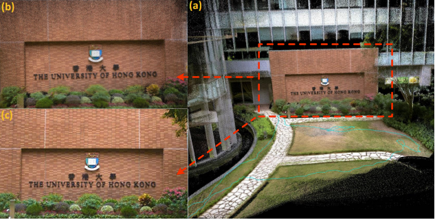
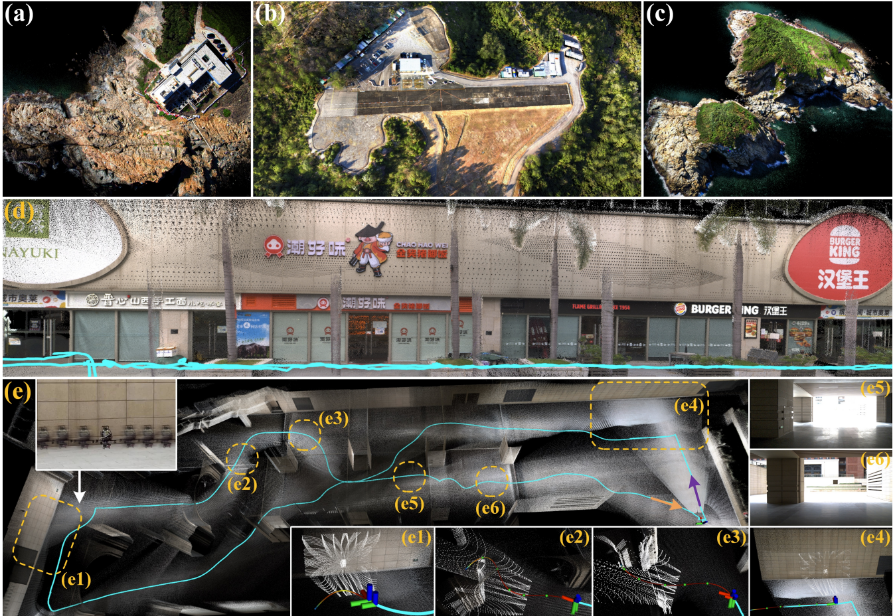

# 1.算法简介

香港大学MaRS实验室非常高产且质量上乘，其博士生郑纯然（主页：https://github.com/xuankuzcr）堪称SLAM界的「多模态卷王」，他带着激光雷达、IMU和相机玩跨界融合，搞出两代标杆算法：

✅ IROS 2022 FAST-LIVO：实时定位「三体联动」黑科技
✅ T-RO 2024 FAST-LIVO2：异构融合直接封神，开源代码直接被同行当「参考答案」

左手破解传感器时空结界，右手用3D高斯溅射 (3DGS) 给地图打全息光影，从毫米级追踪到像素级建模，把机器人感知玩成赛博科幻片。

FAST-LIVO系列成果：一个极其高效的，抵抗各种极端退化环境，首个可以用到UAV自动导航的激光雷达-视觉-惯性里程计，并可以实时重建像素级高精度彩色点云地图。

FAST-LIVO简介:

1. 一个紧凑的LiDAR惯性视觉里程计框架，它建立在两个直接且紧密耦合的里程计系统上: LIO子系统和VIO子系统。这两个子系统通过将各自的激光雷达或可视化数据与imu融合，共同估计系统状态。
2. 一个直接高效的VIO子系统，最大限度地重用LIO子系统中构建的点云图。具体来说，地图中的点会与之前观测到的图像块关联，通过最小化直接光度误差，将点投影到新图像上来对齐其姿态（因此是完整的系统状态）。VIO子系统中的LiDAR点云重用避免了视觉特征的提取，三角化以及优化，并在测量层面上将两个传感器耦合起来。
3. 本系统实现了开源，可以在Intel或ARM处理器上实时运行，并支持多线旋转激光雷达和具有完全不同扫描模式的新兴固态激光雷达。

论文标题： FAST-LIVO: Fast and Tightly-coupled Sparse-Direct LiDAR-Inertial-Visual Odometry

文章链接：https://arxiv.org/abs/2203.00893

FAST-LIVO2简介:

FAST-LIVO2是在之前提出的业内SOTA方案FAST-LIVO的基础上开发的。与FAST-LIVO相比，新的贡献如下：

1. 提出了一个高效的ESIKF框架，通过惯顺更新(sequential update)解决了激光雷达和视觉测量之间的维度不匹配问题，提高了FAST-LIVO(使用异步更新)的鲁棒性。
2. 维护了统一的融合了视觉和LiDAR测量的voxel map。
3. 使用（甚至精优化了）来自激光雷达点的平面先验以提高准确性。相比之下，FAST-LIVO假设一个图像块中的所有像素具有相同的深度，这个假设会大大降低了图像对齐中仿射变换的准确性。
4. 提出了一种参考图像块更新策略，通过选择高质量的有效的参考图像块（具有大视差和足够的纹理细节）来提高图像对齐的准确性。FAST-LIVO根据与当前视角的夹角去选择参考图像块，这往往导致低质量的参考图像块降低准确性。
5. 进行在线曝光时间估计以处理环境光照变化。FAST-LIVO没有解决这个问题，导致在光照变化显著的情况下图像对齐收敛性差。
6. 提出了按需体素射线投射，以增强在激光雷达点测量缺失（由激光雷达近距离盲区引起）时系统的鲁棒性，这是FAST-LIVO未考虑的问题。

**那FAST-LIVO2能做什么呢？**

1. **实时高精度重建:** 系统能够实时生成照片级高精度的稠密彩色点云。更重要的是，它可以在基于ARM架构的低算力平台 (如rk3588，Jetson Orin NX，RB5等) 上实时运行。
2. **极端环境下的稳定性:** 可以在极度退化且无GPS信号的矿洞隧道里 (超过25min采集) 稳定建图且返回原点。另外我们还在大量激光雷达/视觉退化数据 (超过2TB) 上进行过测试，验证了其高效和鲁棒性。
3. **无人机自主导航突破:** FAST-LIVO2是世界上首个将激光雷达-惯性-视觉里程计 (LIVO) 系统应用于无人机自动导航的方案。它使得无人机能够在激光雷达和视觉均退化的场景中保持稳定工作。
4. **航空测绘精度提升:** 有效解决了航空测绘中出现的激光雷达退化或点云测量不准导致的累计误差问题 (空对地距离太远，光斑效应明显)，进而得到像素级建图结果。
5. **3D场景表达的下游应用支持：**为下游应用 (如Mesh生成以及纹理贴图，深度监督的3D Gaussian Splatting等) 快速生成稠密且准确的大规模彩色点云和相机位姿。
6. **实景三维扫描：**凭借非接触、高精度、高细节、高效率、大尺度等特性获取古代建筑，地貌景观等三维数据，然后导入UE5建模软件中，使得游戏 (比如黑神话悟空DLC) 中建筑在细节上能与现实世界相媲美。

FAST-LIVO2的源码，数据集，手持和无人机设备，硬同步方案以及后续的应用会开源在[GitHub](https://github.com/hku-mars/FAST-LIVO2)中，以促进机器人和CV社区的发展。

论文标题：FAST-LIVO2: Fast, Direct LiDAR-Inertial-Visual Odometry

文章链接：https://arxiv.org/abs/2408.14035

# 2.复现算法流程说明

0.此教程适配ubuntu20.04 noetic版本

1.实验设备准备和安装

2.STM32硬件准备、程序烧录、效果展示

3.AVIA雷达环境搭建、驱动调试、硬同步测试

4.海康相机雷达环境搭建、驱动调试、硬同步测试

5.相机内参标定和雷达-相机联合标定

6.算法部署与数据集测试

7.本地数据集录制与测试

8.一键启动脚本

9.补充事项（待定）

# 3.复现过程参考项目部分链接汇总

FAST-LIVO ：https://github.com/hku-mars/FAST-LIVO

FAST-LIVO2 ：https://github.com/hku-mars/FAST-LIVO2

港大数据集 ：https://connecthkuhk-my.sharepoint.com/personal/zhengcr_connect_hku_hk/_layouts/15/onedrive.aspx?ga=1

手持设备 ：https://github.com/xuankuzcr/LIV_handhold

AVIA SDK ：https://github.com/Livox-SDK/Livox-SDK

AVIA 产品页：https://www.livoxtech.com/cn/avia

相机内参标定 ：https://wiki.ros.org/camera_calibration

雷达-相机联合标定 ：https://github.com/hku-mars/livox_camera_calib/tree/master

gwmuana复现教程 ：https://gitee.com/gwmunan/ros2/wikis/pages?sort_id=10502383&doc_id=4855084
