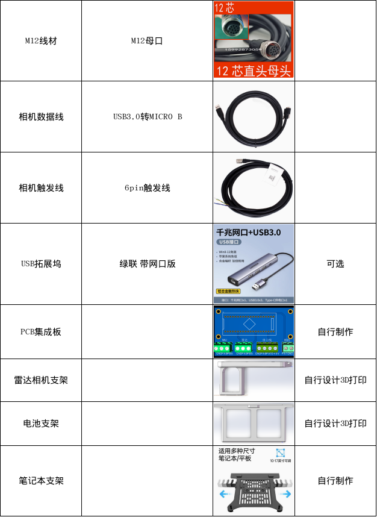
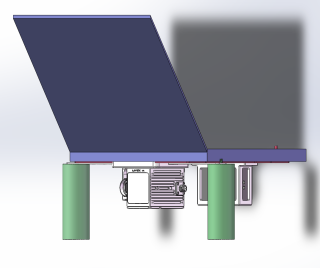
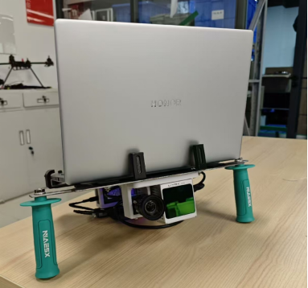
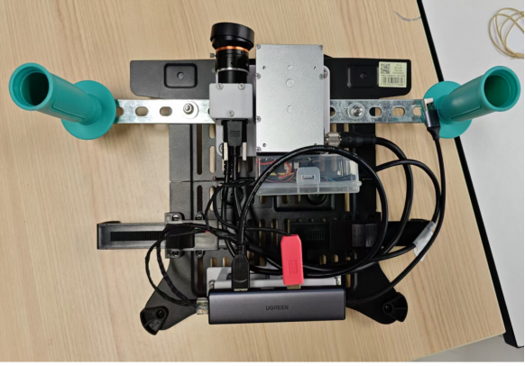

为了快速部署算法需要搭建一个类似官方录制数据集的实验设备

# 1.硬件设备清单

# 2.安装效果图

3D模型图
实物图
实物图背面

# 3.整体线序图

# 4.注意事项

1. 购买的M12线材要确定每个针脚的线序和定义
2. M12线材需要自行压制网络水晶头
3. 需要有一定的焊接和硬件组装功底
4. 雷达相机支架要自行设计后3D打印安装
5. 笔记本支架和手柄自行安装
6. PCB集成板自行打板焊接
