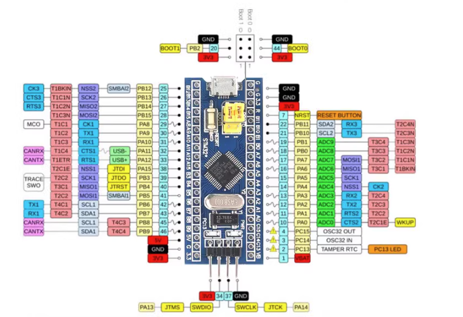

# 1.同步方法简介

Livox AVIA与MID360均支持3种时间同步方式：

 **PTP** ：IEEE 1588v2.0 UDP/IP 网络协议同步，详见：[PTP时间同步](https://livox-wiki-cn.readthedocs.io/zh-cn/latest/tutorials/new_product/common/time_sync.html#ptp)；

 **gPTP** : 车载以太网时间同步协议(二层)，详见：[gPTP时间同步](https://livox-wiki-cn.readthedocs.io/zh-cn/latest/tutorials/new_product/common/time_sync.html#gptp);

 **GPS** ：秒脉冲+GPRMC时间数据，组成GPS时间同步方式，又称PPS同步，详见：[GPS时间同步](https://livox-wiki-cn.readthedocs.io/zh-cn/latest/tutorials/new_product/common/time_sync.html#gps)；

注意：

1. GPS时间同步的时间限制范围为2000年-1月1日-00:00到2037年-12月31日
2. PTP时间同步不支持IEEE1588v2.1
3. 不推荐应用于IEEE1588v2.0与gPTP同时存在的场景中；

# 2.STM32硬同步方案

因为室内和部分室外场景无GPS信号，所以采用STM32模拟GPS授时设备输出秒脉冲+GPRMC时间数据给雷达进行硬同步。

要实现的功能

1. PB5输出1HZ PWM波
2. PA9输出1HZ GPRMC信息
3. PA1输出10HZ PWM波


注意：此处的时间对齐可参考[该视频](https://www.bilibili.com/video/BV1Hr2UYAESm/?spm_id_from=333.1365.list.card_archive.click)，后续的代码已经内置对齐代码，无需修改代码。

# 3.STM32简介

STM32F103C8T6是基于ARM Cortex-M3内核的32位微控制器，最高主频72MHz。它拥有64KB Flash和20KB SRAM，工作电压2V至3.6V，工作温度-40°C至85°C。封装为LQFP48，具备丰富的外设资源，包括多个定时器、通信接口、ADC和DAC等。




# 4.程序准备和烧录

程序链接：https://github.com/xuankuzcr/LIV_handhold

通过keil5编译程序后下载HEX文件，通过串口或STlink烧录到STM32中，为了方便供电和观察数据，本文采用串口线的方式进行烧录程序。
接线顺序

|   STM32   | 串口线 |
| :-------: | :----: |
|    +5V    |  VCC  |
| PA9(TX1) |   RX   |
| PA10(RX1) |   TX   |
|    GND    |  GND  |


打开 FlyMcu软件，选好端口，设置波特率为115200


烧录时单片机上跳线帽boot0 置1，烧录完毕后boot0置0

需要将跳线帽如上图插到指定位置，在上电后可能需要按复位键才能成功。
点击开始编程即可。

代码中GPRMC数据标准格式说明：

```
 $GPRMC,014600.00,A,2237.496474,N,11356.089515,E,0.0,225.5,310518,2.3,W,A*23
```

内容说明：

```
field 0：$GPRMC, 格式ID，表示该格式为建议的最低特定GPS / TRANSIT数据（RMC）推荐最低定位信息
field 1: UTC时间, 格式hhmmss.ssss，代表时分秒.毫秒
field 2: 状态 A:代表定位成功 V:代表定位失败 
field 3: 纬度 ddmm.mmmmmm 度格式（如果前导位数不足，则用0填充）
field 4: 纬度 N(北纬)  S(南纬)
field 5: 经度 dddmm.mmmmmm 度格式（如果前导位数不足，则用0填充）
field 6: 经度 E(东经) W(西经)
field 7: 速度（也为1.852 km / h）
field 8: 方位角，度（二维方向，等效于二维罗盘）
field 9: UTC日期 DDMMYY 天月年
field 10: 磁偏角（000-180）度，如果前导位数不足，则用0填充）
field 11: 磁偏角方向E =东W =西
field 12: 模式，A =自动，D =差分，E =估计，AND =无效数据（3.0协议内容）
field 13: 校验和
```

# 5.效果展示

给STM32通过串口线供电后，程序自动输出信号：

1.PB5输出1HZ PWM波（示意图不必完全一致）


黄色波形为1HZ PWM波（PPS信号）
绿色为1HZ GPRMC信息

2.PA9输出1HZ GPRMC信息


3.PA1输出10HZ PWM波 （示意图不必完全一致）

