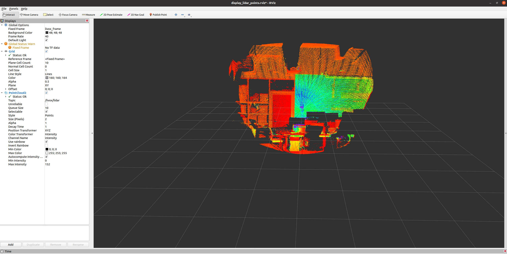
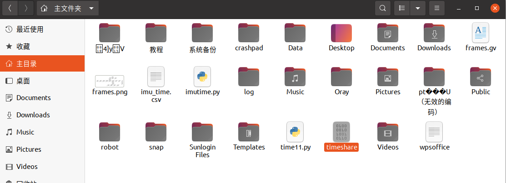

# 1.雷达接线


将雷达按教程1中线序表把雷达与485模块、拓展坞、STM32、锂电池、PC等链接到一起。

# 2.雷达客户端安装和同步测试

下载[Livox Viewer 0.10.0(64bit) - Ubuntu 16.04](https://terra-1-g.djicdn.com/65c028cd298f4669a7f0e40e50ba1131/Download/update/Livox_Viewer_For_Linux_Ubuntu16.04_x64_0.10.0.tar.gz)客户端

阅读[AVIA 用户手册](https://terra-1-g.djicdn.com/65c028cd298f4669a7f0e40e50ba1131/Download/Avia/Livox%20Avia%20%E7%94%A8%E6%88%B7%E6%89%8B%E5%86%8C%E4%B8%AD%E6%96%87.pdf)和[Livox Viewer手册](https://terra-1-g.djicdn.com/65c028cd298f4669a7f0e40e50ba1131/Download/update/Livox%20Viewer%20User%20Manual%20v1.4%20chs.pdf)

打开终端窗口，关闭电脑防火墙

```
sudo ufw disable
```

设置电脑有线模式IP类型为静态IP，IP地址为192.168.1.2，子网掩码为255.255.255.0，默认网关为192.168.1.1


解压客户端文件，在客户端文件目录下打开终端，输入命令启动客户端

```
./livox_viewer.sh
```


链接雷达，点击工具栏中的播放按纽，点云显示界面就会出现点云，注意雷达要距离被测物体超过1m远。


在雷达接入STM32通过485模块发出的PPS信号后，在客户端点击雷达的设置按钮，会看到Time Sync：PPS Sync，说明雷达同步触发正常。


# 3.雷达驱动安装与测试

在进行完成雷达客户端测试，确定雷达本身没有问题即可进行ROS驱动测试

## 1.依据官方流程下载和安装[Livox SDK](https://github.com/Livox-SDK/Livox-SDK)

依赖

Livox SDK 依赖于 cmake 。你可以通过 apt 工具安装这些依赖包 :

```
sudo apt install cmake
```

编译 Livox SDK

在 Livox SDK 目录中，执行以下指令编译工程:

```
git clone https://github.com/Livox-SDK/Livox-SDK.git
cd Livox-SDK
cd build && cmake ..
make
sudo make install
```

## 2.安装雷达ROS驱动

此处选择带时间对齐的AVIA雷达驱动[livox_ros_driver](https://github.com/xuankuzcr/LIV_handhold/tree/main/livox_ros_driver "livox_ros_driver")：https://github.com/xuankuzcr/LIV_handhold/tree/main/livox_ros_driver

新建Livox_ws文件夹，在该文件夹内建立src文件夹，将下载的[livox_ros_driver](https://github.com/xuankuzcr/LIV_handhold/tree/main/livox_ros_driver "livox_ros_driver")放置到src目录下

在Livox_ws文件夹下打开终端，编译程序

```
catkin_make
```

成功后使用如下命令更新当前 ROS 包环境

`source ./devel/setup.sh`

设置livox_lidar_config.json文件中 `"enable_timesync": fasle ` ，启动雷达luanch文件进行非同步测试

```
roslaunch livox_ros_driver livox_lidar_rviz.launch
```

即可在rviz中查看到点云

点云图

关闭程序，启动雷达进行数据测试

```
roslaunch livox_ros_driver livox_lidar_msg.launch
```

此时没有点云显示到rviz中，可以通过在其他终端监听雷达话题来判断雷达是否工作

```
rostopic list
```


查看是否有话题：livox/lidar和livox/imu出现，如果有则说明启动正常。

补充说明：
launch文件中xfer_format 设置点云格式
0 – 览沃 pointcloud2(PointXYZRTL) 点云格式
1 – 览沃自定义点云数据格式(CustomMsg)
2 – PCL库中标准 pointcloud2(pcl::PointXYZI) 点云格式

更加详细的配置参数请参考livox_ros_driver文件中的README文档。

# 4.雷达硬同步测试

1.连接设备

先给雷达供电，将串口线一端与STM32相连，一端与拓展坞相连，雷达网线也接入拓展坞，最后将拓展坞接入PC

2.修改雷达配置文件

设置livox_lidar_config.json文件中 `"enable_timesync": true`

3.启动雷达驱动

在Livox_ws文件夹下打开终端，更新当前 ROS 包环境，打开串口，启动雷达驱动

```
source ./devel/setup.sh
sudo chmod 777 /dev/ttyUSB0
roslaunch livox_ros_driver livox_lidar_msg.launch
```

4.录制同步后点云与IMU话题
打开新终端，录制点云与IMU话题

```
rosbag record /livox/lidar /livox/imu
```

5.查看bag文件的点云格式(CustomMsg)、时间戳以及根目录下的timeshare文件是否生成

```
rqt_bag xxx.bag
```




查看两者的时间戳是否一致，且为STM32发出的时间信息，[时间戳转换工具](https://tool.lu/timestamp/)
