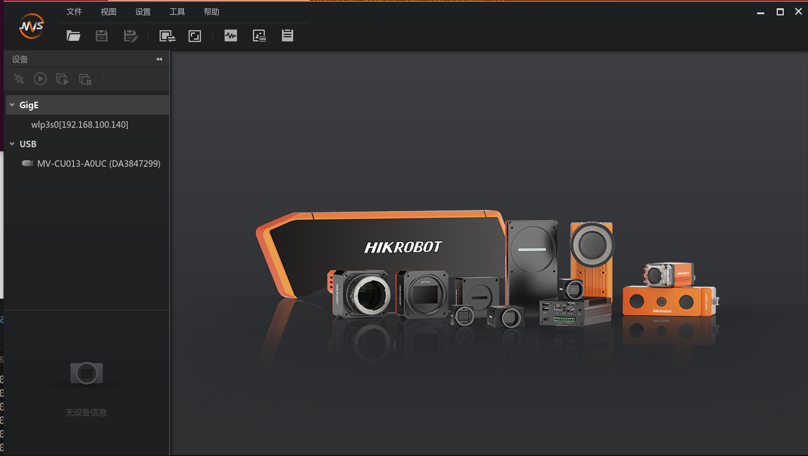
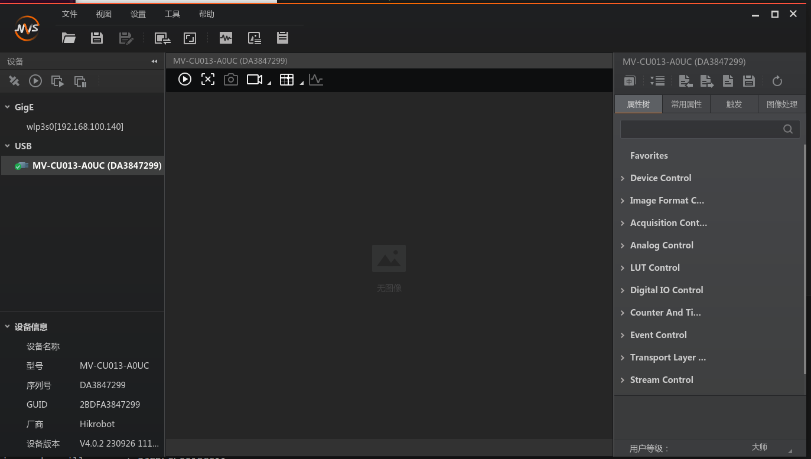
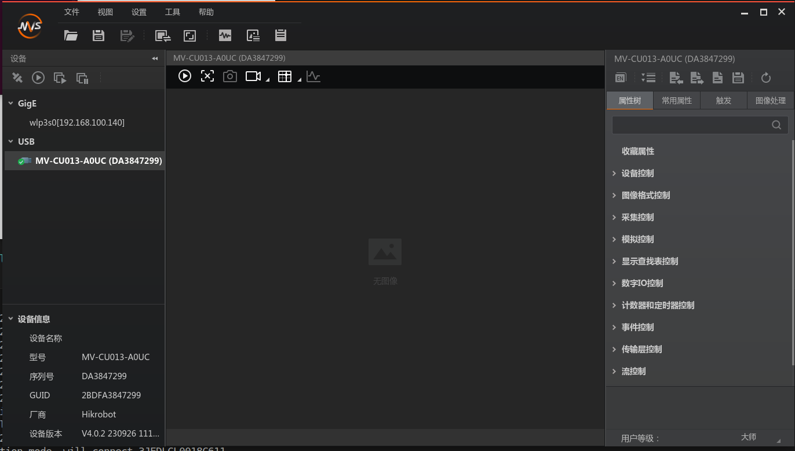
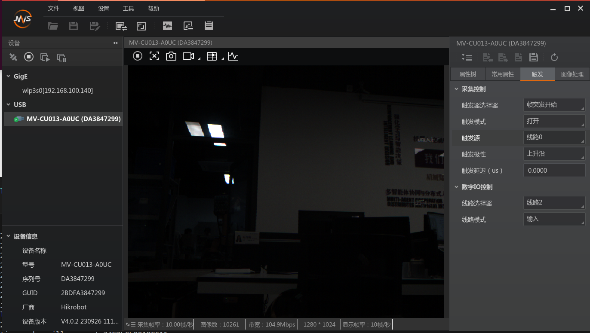
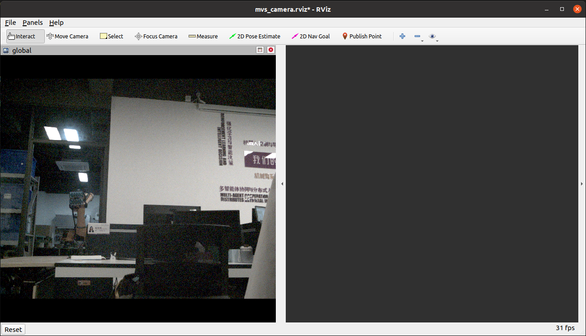
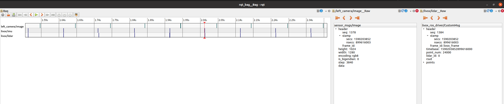

# 1.相机接线


将相机按教程1中线序表把相机、雷达、485模块、拓展坞、STM32、锂电池、PC等全部链接到一起。

# 2.相机客户端安装和同步测试

下载[客户端MVS](https://www.hikrobotics.com/cn2/source/support/software/MVS_STD_V3.0.1_241128.zip)

解压文件后阅读所带README文档，安装相应的客户端

找到/opt/MVS/bin文件夹，新建终端，启动客户端（客户端使用手册也在该文件夹）

```
./MVS.sh
```

选择相机，双击启动


点击右侧工具栏的中字按钮，切换中文模式

点击播放按钮进行图像采集，右侧工具栏可设置相机的各个属性，详情请查看[相机用户手册](https://www.hikrobotics.com/cn2/source/vision/document/2025/1/20/%E6%B5%B7%E5%BA%B7%E6%9C%BA%E5%99%A8%E4%BA%BAUSB3.0%E5%B7%A5%E4%B8%9A%E9%9D%A2%E9%98%B5%E7%9B%B8%E6%9C%BA%E7%94%A8%E6%88%B7%E6%89%8B%E5%86%8CV3.0.1_1690.pdf)


在把相机连接到STM32并上电后可以进行同步测试

启动客户端MVS，在客户端中设置 `触发模式 打开，触发源 线路0，`启动相机拍摄，查看图像左下角的相机帧率是否为10HZ，是10HZ说明相机触发正常


# 3.相机驱动安装与测试

此处选择带时间对齐的海康相机驱动[mvs_ros_pkg](https://github.com/xuankuzcr/LIV_handhold/tree/main/mvs_ros_pkg):https://github.com/xuankuzcr/LIV_handhold/tree/main/mvs_ros_pkg

新建HKcamera_ws文件夹，在该文件夹内建立src文件夹，将下载的[mvs_ros_pkg](https://github.com/xuankuzcr/LIV_handhold/tree/main/mvs_ros_pkg)放置到src目录下

在HKcamera_ws文件夹下打开终端，编译程序

```
catkin_make
```

成功后使用如下命令更新当前 ROS 包环境

`source ./devel/setup.sh`

设置left_camera_trigger.yaml文件中  `TriggerEnable: 0 ; PixelFormat: 3 ` ，启动相机luanch文件进行非同步测试

```
roslaunch mvs_ros_pkg mvs_camera_trigger.launch
```

即可在rviz中查看到图像


# 4.雷达-相机硬同步测试

1.将相机按教程1中线序表把相机、雷达、485模块、拓展坞、STM32、锂电池、PC等全部链接到一起。

2.修改雷达、相机配置文件

设置left_camera_trigger.yaml文件中  `TriggerEnable: 1 ` ，设置livox_lidar_config.json文件中 `"enable_timesync": true`

3.启动雷达、相机程序

a.在雷达驱动文件夹下新建终端，加载环境，打开串口，启动livox_lidar_msg.launch文件

```
source ./devel/setup.sh
sudo chmod 777 /dev/ttyUSB0
roslaunch livox_ros_driver livox_lidar_msg.launch
```

b.在相机驱动文件夹下新建终端，加载环境，启动相机mvs_camera_trigger.launch文件

```
source ./devel/setup.sh
roslaunch mvs_ros_pkg mvs_camera_trigger.launch
```

4.新建终端录制雷达、IMU、相机话题

```
rosbag record /livox/lidar /livox/imu /left_camera/image
```

5.查看bag文件的点云、相机时间是否一致(选中数据右键查看)，相差在20ms内说明同步完成

```
rqt_bag xxx.bag
```


