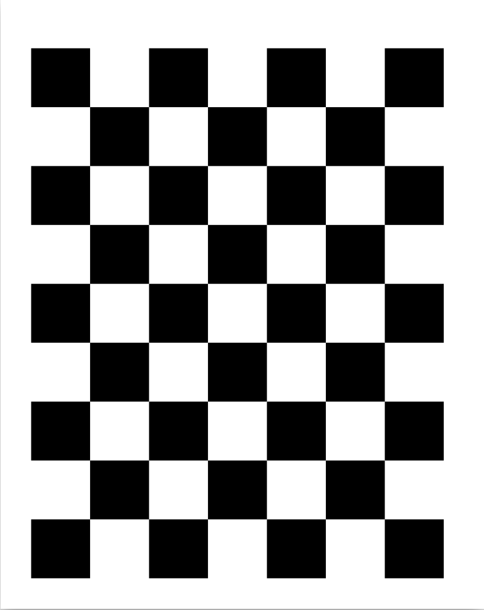
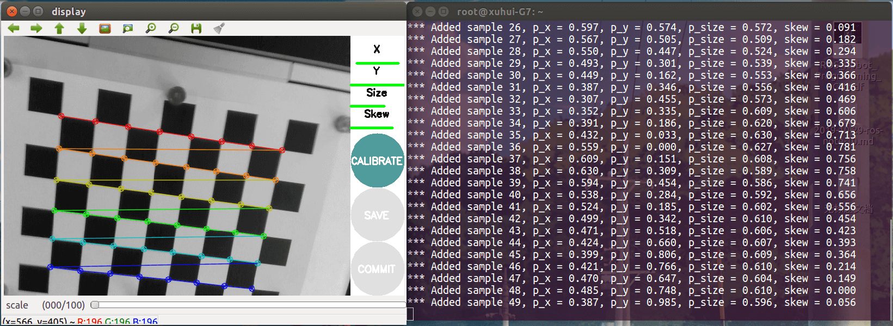
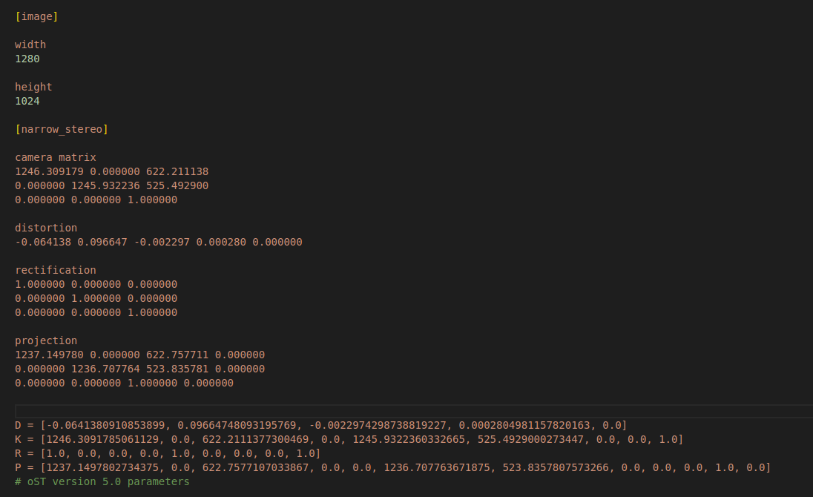
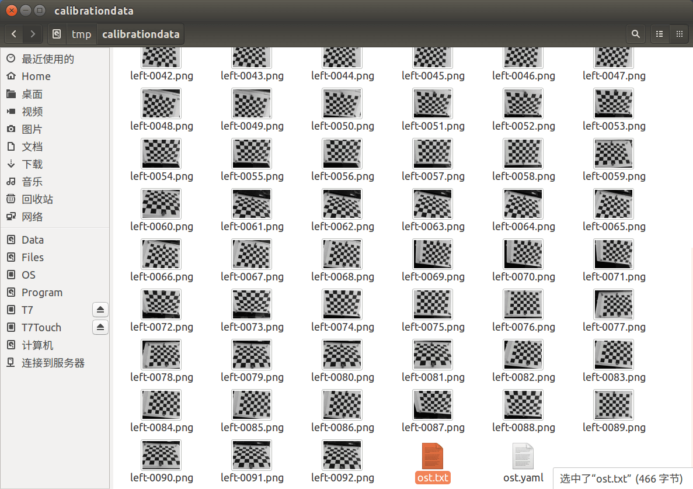
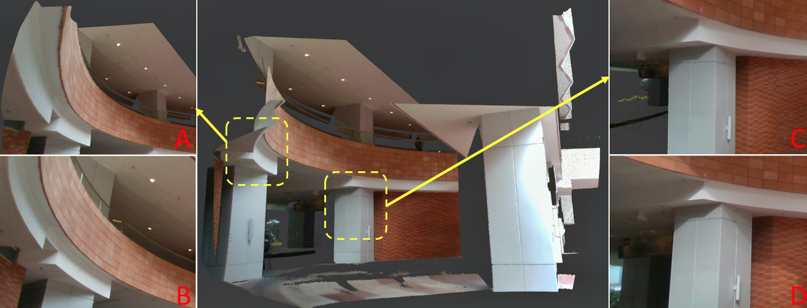
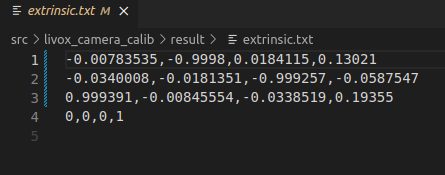
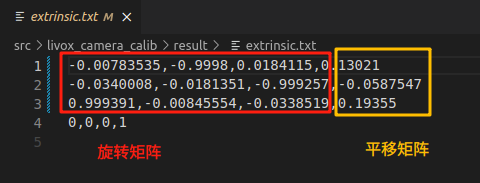

# 在运行Fast Livo前最重要的工作有两项：

1.时间同步
2.传感器参数标定
这两项工作也决定了最终Fast Livo所呈现出来的效果品质。

# 1.相机内参标定

本文采用**Camera Calibration来进行相机内采纳标定，详细环节参考[此文章](https://blog.csdn.net/hai411741962/article/details/133809244?ops_request_misc=%257B%2522request%255Fid%2522%253A%2522fdc4dbeb1fb4b5ebe8483516726a6c80%2522%252C%2522scm%2522%253A%252220140713.130102334..%2522%257D&request_id=fdc4dbeb1fb4b5ebe8483516726a6c80&biz_id=0&utm_medium=distribute.pc_search_result.none-task-blog-2~all~baidu_landing_v2~default-5-133809244-null-null.142^v101^pc_search_result_base9&utm_term=camera_calibration%E6%A0%87%E5%AE%9A&spm=1018.2226.3001.4187)**

1.安装标定功能包

`sudo apt install ros-$ROS_DISTRO-camera-calibration`

2.准备棋盘格
本文采用淘宝购买的成品棋盘格标定板
也可打印棋盘格：可直接下载此文件并打印（原尺寸居中）出来（打印棋盘格的尺寸精度与打印机有关）


3.启动标定程序
a.在相机驱动文件夹下，启动终端，打开相机节点：

```
source ./devel/setup.sh
roslaunch mvs_ros_pkg mvs_camera_trigger.launch
```

b.新建终端，打开标定节点：

```
rosrun camera_calibration cameracalibrator.py --size 17x17 --square 0.2 image/image:=/left_camera/image
```

cameracalibrator.py标定程序需要以下几个输入参数。

1）size：标定棋盘格的内部角点个数，这里使用的棋盘一共有6行，每行有8个内部角点。

2）square：这个参数对应每个棋盘格的边长，单位是米。

3）image/image：设置摄像头发布的图像话题。

根据使用的摄像头和标定靶棋盘格尺寸，相应修改以上参数，即可启动标定程序。
c.按照提示移动


在没有标定成功前，右边的按钮都为灰色，不能点击。为了提高标定的准确性，应该尽量让标定靶出现在摄像头视野范围内的各个区域，界面右上角的进度条会提示标定进度。

1）X：标定靶在摄像头视野中的左右移动。
2）Y：标定靶在摄像头视野中的上下移动。
3）Size：标定靶在摄像头视野中的前后移动。
4）Skew：标定靶在摄像头视野中的倾斜转动。

不断在视野中移动标定靶，直到“CALIBRATE”按钮变色，表示标定程序的参数采集完成。点击“CALIBRATE”按钮，标定程序开始自动计算摄像头的标定参数，这个过程需要等待一段时间，界面可能会变成灰色无响应状态，注意千万不要关闭。

参数计算完成后界面恢复，而且在终端中会有标定结果的显示。


d.结果保存

击”SAVE”按钮，稍微等待几秒，即可保存标定好的结果。标定结果默认保存在/tmp/calibrationdata.tar.gz，手动拷贝出来即可。内容包含参数文件和标定用到的影像，如下图所示。


# 2.雷达-相机联合标定

本文采用无目标来联合标定 [livox_camera_calib](https://gitee.com/link?target=https%3A%2F%2Fgithub.com%2Fhku-mars%2Flivox_camera_calib%2Ftree%2Fmaster)

litar_camera_calib是无目标环境中高分辨率 LiDAR（例如 Livox）和相机之间的强大、高精度外部校准工具。我们的算法可以在室内和室外场景中运行，并且只需要场景中的边缘信息。如果场景合适，我们可以达到类似于甚至超越基于目标的方法的像素级精度。


对场景有一定要求（沦落清晰的边角线+光线对比明显），操作上要求较高

依据官方说明安装依赖环境，然后编译程序 [livox_camera_calib](https://gitee.com/link?target=https%3A%2F%2Fgithub.com%2Fhku-mars%2Flivox_camera_calib%2Ftree%2Fmaster)

```
cd ~/catkin_ws/src
git clone https://github.com/hku-mars/livox_camera_calib.git
cd ../
catkin_make
source ~/catkin_ws/devel/setup.bash
```

## a.选好场景，启动雷达、相机，保持静止，录制10S点云和图像话题

启动雷达

```
source ./devel/setup.sh
sudo chmod 777 /dev/ttyUSB0
roslaunch livox_ros_driver livox_lidar_msg.launch
```

启动相机

```
source ./devel/setup.sh
roslaunch mvs_ros_pkg mvs_camera_trigger.launch
```

录制bag文件

```
rosbag record /livox/lidar /livox/imu /left_camera/image
```

## b.从bag中提取图片、pcd

### 1.提取图片，这里参考[CSDN文档](https://blog.csdn.net/ouyangandy/article/details/100116552)中的第一中方法

ROS-从rosbag中提取图像（by launch文件）

1.新建launch文件（文件在哪无所谓，可以在catkin_ws的根目录） : bag2img.launch

```
<launch>
      <node pkg="rosbag" type="play" name="rosbag" args="-d 2 /home/andy/bag_foler/file_name.bag"/>
      <node name="extract" pkg="image/image_view" type="extract_image/images" respawn="false" output="screen" cwd="ROS_HOME">
      <remap from="image/image" to="camera/rgb/image/image_color"/>
      <param name="sec_per_frame" value="0.03"/>
      </node>
 </launch>
```

note:
`/home/andy/bag_foler/file_name.bag` 为你录制的bag文件的绝对路径，`camera/rgb/image/image_color`为你提取的topic的名字，你可以使用：

rosbag info file_name.bag

查看你需要提取的图片的topic名字。< param name="sec_per_frame" value="0.03"/>这句话是说，以每一帧花费0.03s的时间，这个条件对你的bag文件进行图像提取，如果没有这句话，就是默认0.1s，也就是没秒10帧的速率对图像提取。经过我的测试发现，无论怎么调整这个值，都无法跟bag文件中的信息数目匹配，因此来说，这种方法存在一定的图像缺失的情况，只能无限接近袁原始图像的数目，比如我的原始数据有640帧，但经过调整sec_per_frame的值，最高的时候还是只能到639，多数情况下到637，默认值0.1的时候，只有200多张图像。
2.运行launch

```
 roslaunch bag2img.launch
```

那么已经提取成功的图像存储在你home文件夹下的.ros文件夹下，一般是隐藏的文件夹，使用crtl+h可显示出来。

优点：操作简单，使用ros即可；缺点：提取信息与原始录制的信息并不完全一致，主要体现在提取的图片数量和ros录制的时候的信息数量不一致，会少。此外，不含有时间戳；

### 2.提取点云转为pcd

这里可直接调用[livox_camera_calib](https://gitee.com/link?target=https%3A%2F%2Fgithub.com%2Fhku-mars%2Flivox_camera_calib%2Ftree%2Fmaster)中的bag_to_pcd.launch文件

```
roslaunch livox_camera_calib bag_to_pcd.launch
```

## c.启动程序进行联合标定

将提取出的图片和PCD文件放入程序指定目录，即可启动程序标定

```
roslaunch livox_camera_calib calib.launch
```

该最终结果会是一个extrinsic.txt的文件：

结果是个4*4的齐次变换矩阵

