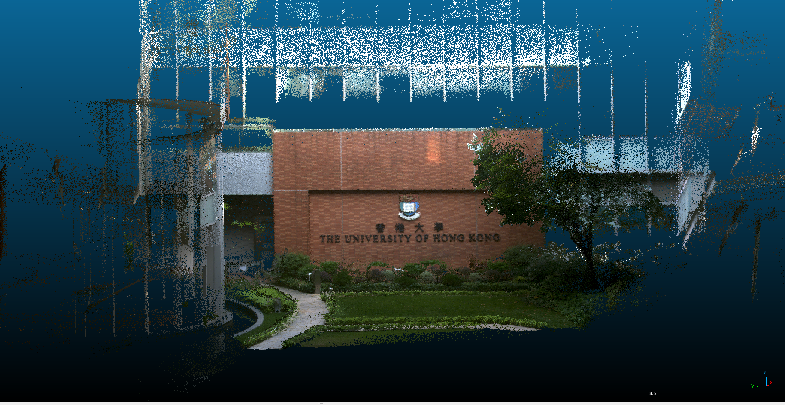

# 1.依据官方步骤安装[FAST-LIVO](https://github.com/hku-mars/FAST-LIVO)

### 1.1 Ubuntu and ROS

Ubuntu 16.04~20.04.  [ROS Installation](http://wiki.ros.org/ROS/Installation).

### 1.2 PCL && Eigen && OpenCV 依赖

PCL>=1.6, Follow [PCL Installation](https://pointclouds.org/).

Eigen>=3.3.4, Follow [Eigen Installation](https://eigen.tuxfamily.org/index.php?title=Main_Page).

OpenCV>=3.2, Follow [Opencv Installation](http://opencv.org/).

### 1.3 Sophus 库安装

 Sophus Installation for the non-templated/double-only version.

```bash
git clone https://github.com/strasdat/Sophus.git
cd Sophus
git checkout a621ff
mkdir build && cd build && cmake ..
make
sudo make install
```

### 1.4 Vikit 库安装

Vikit contains camera models, some math and interpolation functions that we need. Vikit is a catkin project, therefore, download it into your catkin workspace source folder.

```bash
cd catkin_ws/src
git clone https://github.com/uzh-rpg/rpg_vikit.git
```

### 1.5 **livox_ros_driver** 安装

Follow [livox_ros_driver Installation](https://github.com/Livox-SDK/livox_ros_driver).

## 2. Build FAST-LIVO

Clone the repository and catkin_make:

```
cd ~/catkin_ws/src
git clone https://github.com/hku-mars/FAST-LIVO
cd ../
catkin_make
source ~/catkin_ws/devel/setup.bash
```

# 2.依据官方步骤安装[FAST-LIVO2](https://github.com/hku-mars/FAST-LIVO2)

### 1.1 Ubuntu and ROS

Ubuntu 16.04~20.04.  [ROS Installation](http://wiki.ros.org/ROS/Installation).

### 1.2 PCL && Eigen && OpenCV 依赖

PCL>=1.6, Follow [PCL Installation](https://pointclouds.org/).

Eigen>=3.3.4, Follow [Eigen Installation](https://eigen.tuxfamily.org/index.php?title=Main_Page).

OpenCV>=3.2, Follow [Opencv Installation](http://opencv.org/).

### 1.3 Sophus  库安装

Sophus Installation for the non-templated/double-only version.

```bash
git clone https://github.com/strasdat/Sophus.git
cd Sophus
git checkout a621ff
mkdir build && cd build && cmake ..
make
sudo make install
```

### 1.4 Mimalloc (optional) 安装

Mimalloc is a high-performance memory allocator developed by Microsoft, optimized for speed and memory efficiency.

```bash
git clone https://github.com/microsoft/mimalloc.git
mkdir build && cd build && cmake ..
make
sudo make install
```

### 1.5 Vikit 库安装

Vikit contains camera models, some math and interpolation functions that we need. Vikit is a catkin project, therefore, download it into your catkin workspace source folder.

```bash
cd catkin_ws/src
git clone https://github.com/xuankuzcr/rpg_vikit.git
```

### 1.6 **livox_ros_driver** 安装

Follow [livox_ros_driver Installation](https://github.com/Livox-SDK/livox_ros_driver).

## 2. Build  FAST-LIVO2

Clone the repository and catkin_make:

```
cd ~/catkin_ws/src
git clone https://github.com/hku-mars/FAST-LIVO2
cd ../
catkin_make
source ~/catkin_ws/devel/setup.bash
```

# 3.数据集测试

下载官方数据集[FAST-LIVO2-Dataset](https://connecthkuhk-my.sharepoint.com/:f:/g/personal/zhengcr_connect_hku_hk/ErdFNQtjMxZOorYKDTtK4ugBkogXfq1OfDm90GECouuIQA?e=KngY9Z)，由于onedrive在国内不太好用，我上传了该数据集到百度网盘[FAST-LIVO2官方数据集](https://pan.baidu.com/s/13W2VAEBCVJi7PF210r_nSA?pwd=wxit)

根据数据集所提供的雷达和相机参数修改两个算法中的yaml文件

启动FAST-LIVO

```
roslaunch fast_livo mapping_avia_ntu.launch
rosbag play YOUR_DOWNLOADED.bag
```

启动FAST-LIVO2

```
roslaunch fast_livo mapping_avia.launch
rosbag play YOUR_DOWNLOADED.bag
```

查看保存的PCD文件

FAST-LIVO算法的PCD文件保存在FAST-LIVO_ws/src/FAST-LIVO/PCD文件夹

FAST-LIVO2算法的PCD文件保存在FAST-LIVO2_ws/src/FAST-LIVO2/Log/PCD文件夹

没有文件夹目录则自行新建一个

## 4.注意事项

1.两个算法所依赖的Vikit包不太一致，请按官方步骤安装

2.不同数据集的yaml不同，按官方说明去修改config文件中的配置

## 5.效果展示

Red_Sculpture-FAST-LIVO

Red_Sculpture-FAST-LIVO2


CBD01-FAST-LIVO2


CBD02-FAST-LIVO2


Retail_Street-FAST-LIVO2


HKU_Campus-FAST-LIVO2


HIT_Graffiti_Wall-FAST-LIVO2


SYSU-FAST-LIVO2

