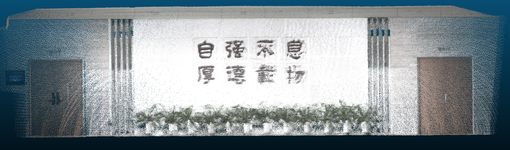
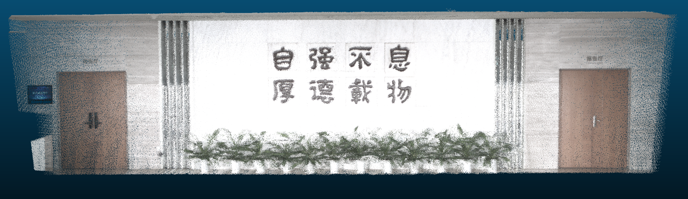
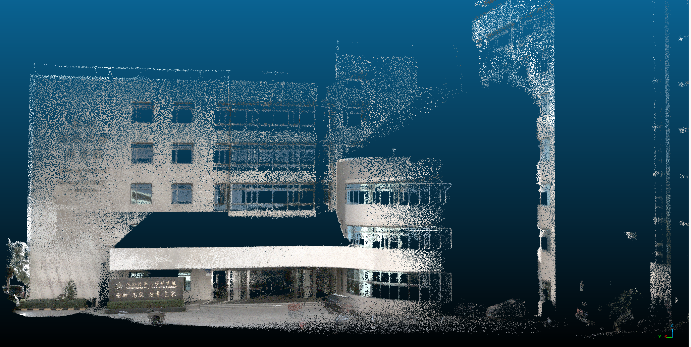
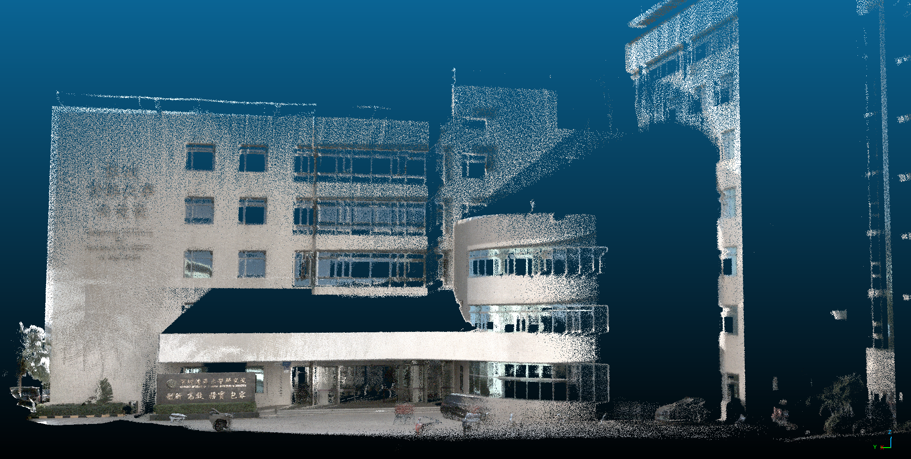

# 1.本地数据集录制

链接STM32、雷达、相机、485模块、拓展坞、电池、PC

启动雷达

```
source ./devel/setup.sh
sudo chmod 777 /dev/ttyUSB0
roslaunch livox_ros_driver livox_lidar_msg.launch
```

启动相机

```
source ./devel/setup.sh
roslaunch mvs_ros_pkg mvs_camera_trigger.launch
```

录制bag文件

```
rosbag record /livox/lidar /livox/imu /left_camera/image
```

# 2.测试

依据相机内参标定和雷达相机联合标定的结果修改两个算法的yaml配置文件

启动算法建图

启动FAST-LIVO

```
roslaunch fast_livo mapping_avia_ntu.launch
rosbag play YOUR_DOWNLOADED.bag
```

启动FAST-LIVO2

```
roslaunch fast_livo mapping_avia.launch
rosbag play YOUR_DOWNLOADED.bag
```

查看保存的PCD文件

# 3.注意事项

1. 在录制数据集时，相机配置参数如下设置，相机镜头光圈在室外手动调到最小，减小进光量，防止画面过曝，在室内则调为最大，增加进光量

   ```
   TopicName: "left_camera/image/image"

   TriggerEnable: 1 # 0 stands for Off, 1 stands for On

   ExposureAutoMode: 0 # 0 stands for Off, 1 stands for Once, 2 stands for Continues
   ExposureTime: 3500 # us

   # ExposureAutoMode: 2
   # AutoExposureTimeLower: 100
   # AutoExposureTimeUpper: 20000

   image/image_scale: 1 # 1 0.5
   GainAuto: 2 # Gain Auto, 0 stands for Off, 1 stands for Once, 2 stands for Continues
   Gain: 5 # min: 0   max: 17.0166
   Gamma: 0.5  # min: 0   max: 17.0166
   GammaSelector: 1 # 0 stands for user, 1 stands for sRGB
   # GammaEnable: 1

   PixelFormat: 3 # 0: RGB8, 1: BayerRG8, 2: BayerRG12Packed, 3: BayerGB12Packed
   ```
2. 录制数据集过程尽量保持运动平稳
3. 

# 4.效果展示

研究院大厅-FSAT-LIVO

研究院大厅-FSAT-LIVO2

研究院门口-FSAT-LIVO

研究院门口-FSAT-LIVO2

