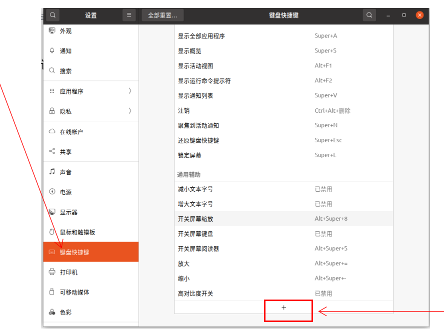
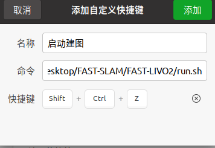
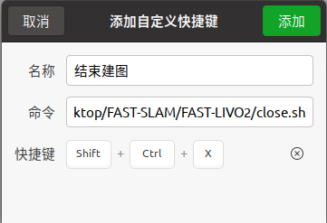

1.脚本一键启动、结束

一键启动脚本run.sh

```
#!/bin/bash

# 定义启动launch的工作目录和命令，此处为FAST-LIVO的目录和启动命令
WORK_DIR1="/home/robot/Desktop/FAST-SLAM/FAST-LIVO2"
CMD1="source devel/setup.bash"
CMD2="roslaunch fast_livo mapping_avia.launch"

# 录制数据集的路径和命令 (此处录制了全部话题，根据实际需要调整录制话题)
WORK_DIR2="/home/robot/Desktop"
CMD3="source /opt/ros/noetic/setup.bash"
CMD4="rosbag record -a"

# 切换到工作目录
cd "$WORK_DIR1" || { echo "Failed to change directory to '$WORK_DIR1'"; exit 1; }

# 启动终端并执行命令
# 使用gnome-terminal作为示例，如果系统不同，可能需要替换为相应的终端模拟器
gnome-terminal -- bash -c "$CMD1; $CMD2; exec bash"

sleep 3

# 切换到录包目录
cd "$WORK_DIR2" || { echo "Failed to change directory to '$WORK_DIR2'"; exit 1; }

# 启动终端并执行命令
# 使用gnome-terminal作为示例，如果系统不同，可能需要替换为相应的终端模拟器
gnome-terminal -- bash -c "$CMD3; $CMD4; exec bash"
```

一键结束脚本colse.sh

```
#!/bin/bash

# 定义要终止的进程的命令行
OTHER_PROCESS="roslaunch fast_livo mapping_avia.launch"
ROSBAG_PROCESS="rosbag"

# 终止所有与rosbag相关的进程，使用SIGINT信号
echo "Terminating $ROSBAG_PROCESS processes..."
pkill -f -SIGINT "$ROSBAG_PROCESS"

# 等待一段时间以确保rosbag进程完全终止
sleep 3

# 再次检查rosbag进程是否还在运行
if pgrep -f "$ROSBAG_PROCESS" > /dev/null; then
    echo "Some $ROSBAG_PROCESS processes are still running. Forcing termination..."
    pkill -9 -f "$ROSBAG_PROCESS"
fi

# 终止指定的另一个进程，使用SIGINT信号
echo "Terminating $OTHER_PROCESS processes..."
pkill -f -SIGINT "$OTHER_PROCESS"

# 等待一段时间以确保另一个进程完全终止
sleep 5

# 再次检查另一个进程是否还在运行
if pgrep -f "$OTHER_PROCESS" > /dev/null; then
    echo "Some $OTHER_PROCESS processes are still running. Forcing termination..."
    pkill -9 -f "$OTHER_PROCESS"
fi

# 获取所有 gnome-terminal 窗口的 ID
terminal_windows=$(xdotool search --class "gnome-terminal")

# 遍历每个窗口并关闭
for win in $terminal_windows; do
    xdotool windowclose $win
done

# 检查是否还有 gnome-terminal 窗口存在
if xdotool search --class "gnome-terminal" > /dev/null; then
    echo "Some gnome-terminal windows are still open."
else
    echo "All gnome-terminal windows have been closed."
fi
```

2.使用说明

1.安装依赖**xdotool**

```
sudo apt install xdotool
```

2.给sh脚本权限（给一次就行）

```
chmod +x run.sh
chmod +x close.sh
```


3.先在桌面终端里分别运行run.sh和close.sh看效果

```
./run.sh
./close.sh
```


4.然后在系统设置->键盘快捷键->新增快捷键中增加run.sh和close.sh的快捷命令


输入run.sh路径和自定义的快捷键命令后点击添加即可。

输入close.sh路径和自定义的快捷键命令后点击添加即可。

然后就可以一键启动，一键关闭了。
